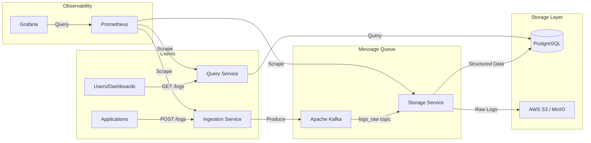

# Cloud-Native Log Analytics System

A distributed, cloud-native log analytics platform built with Spring Boot, Apache Kafka, PostgreSQL, and AWS S3/MinIO.

## 🏗️ Architecture



### Data Flow

1. **Ingestion**: Applications send JSON logs via HTTP POST to the Ingestion Service
2. **Buffering**: Logs are published to Kafka topic `logs_raw` for reliable, high-throughput processing
3. **Storage**: Storage Service consumes from Kafka and:
   - Stores structured fields (timestamp, level, service, message) in PostgreSQL for fast querying
   - Archives raw JSON logs to **AWS S3** (production) or **MinIO** (local dev) for compliance and deep analysis
4. **Query**: Query Service provides REST APIs for searching and analyzing logs from PostgreSQL

## 📦 Tech Stack

| Component | Technology | Purpose |
|-----------|------------|---------|
| Ingestion Service | Spring Boot 3.x | HTTP API, validation, Kafka producer |
| Storage Service | Spring Boot 3.x | Kafka consumer, DB writes, S3 uploads |
| Query Service | Spring Boot 3.x | REST API for log queries and analytics |
| Message Queue | Apache Kafka | Reliable log buffering and distribution |
| Database | PostgreSQL 15 | Structured log storage with indexing |
| Object Storage | **AWS S3** / MinIO | Raw log archival (cloud or local) |
| Metrics | Prometheus | Metrics collection and alerting |
| Dashboards | Grafana | Visualization and monitoring |
| Containers | Docker + K8s | Deployment and orchestration |

## 🚀 Quick Start (Local Development)

### Prerequisites

- Docker & Docker Compose
- Java 17+ (for local development)
- Maven 3.8+ (for local development)

### Run with Docker Compose

```bash
# Start all infrastructure and services
cd infra
docker compose up -d

# Check status
docker compose ps
docker compose logs -f kafka

# Wait for services to be healthy (about 30 seconds)
```

### Test the System

```bash
# Ingest a log
curl -X POST http://localhost:8081/logs \
  -H "Content-Type: application/json" \
  -d '{
    "timestamp": "2024-01-15T10:30:00Z",
    "serviceName": "user-service",
    "level": "INFO",
    "message": "User login successful",
    "host": "pod-123",
    "traceId": "abc-123-xyz"
  }'

# Query logs
curl "http://localhost:8083/logs?serviceName=user-service&level=INFO&size=10"

# Get error stats
curl "http://localhost:8083/stats/errors-per-service?from=2024-01-01T00:00:00Z&to=2024-12-31T23:59:59Z"

# Check health
curl http://localhost:8081/actuator/health
curl http://localhost:8082/actuator/health
curl http://localhost:8083/actuator/health
```

### Access Dashboards

- **Grafana**: http://localhost:3000 (admin/admin)
- **Prometheus**: http://localhost:9090
- **MinIO Console**: http://localhost:9001 (minioadmin/minioadmin123)

---

## ☁️ AWS Deployment

The system supports **AWS S3** for production deployments. Simply switch the storage provider configuration.

### AWS Services Used

| AWS Service | Purpose | Local Alternative |
|-------------|---------|-------------------|
| **Amazon S3** | Raw log archival | MinIO |
| Amazon MSK | Managed Kafka | Local Kafka |
| Amazon RDS | Managed PostgreSQL | Local PostgreSQL |
| Amazon EKS | Kubernetes | Minikube/Kind |

### Configure AWS S3

1. **Create an S3 bucket** for log storage:
   ```bash
   aws s3 mb s3://my-logs-bucket --region us-east-1
   ```

2. **Set environment variables** for the storage-service:
   ```bash
   export STORAGE_PROVIDER=aws-s3
   export AWS_REGION=us-east-1
   export AWS_S3_BUCKET=my-logs-bucket
   
   # For local development with explicit credentials:
   export AWS_ACCESS_KEY_ID=your-access-key
   export AWS_SECRET_ACCESS_KEY=your-secret-key
   
   # In production, use IAM roles instead (recommended)
   ```

3. **Run the storage service**:
   ```bash
   cd storage-service
   mvn spring-boot:run
   ```

### IAM Policy for S3 Access

For production, attach this policy to your EC2/EKS role:

```json
{
  "Version": "2012-10-17",
  "Statement": [
    {
      "Effect": "Allow",
      "Action": [
        "s3:PutObject",
        "s3:GetObject",
        "s3:ListBucket"
      ],
      "Resource": [
        "arn:aws:s3:::my-logs-bucket",
        "arn:aws:s3:::my-logs-bucket/*"
      ]
    }
  ]
}
```

### Storage Provider Configuration

| Environment Variable | Options | Default | Description |
|---------------------|---------|---------|-------------|
| `STORAGE_PROVIDER` | `minio`, `aws-s3` | `minio` | Storage backend selection |
| `AWS_REGION` | AWS region | `us-east-1` | AWS region for S3 |
| `AWS_S3_BUCKET` | Bucket name | `logs-raw` | S3 bucket for raw logs |
| `AWS_ACCESS_KEY_ID` | Access key | - | AWS access key (optional with IAM) |
| `AWS_SECRET_ACCESS_KEY` | Secret key | - | AWS secret key (optional with IAM) |

### Docker Compose with AWS S3

```yaml
# Override storage-service to use AWS S3
storage-service:
  environment:
    STORAGE_PROVIDER: aws-s3
    AWS_REGION: us-east-1
    AWS_S3_BUCKET: my-logs-bucket
    AWS_ACCESS_KEY_ID: ${AWS_ACCESS_KEY_ID}
    AWS_SECRET_ACCESS_KEY: ${AWS_SECRET_ACCESS_KEY}
```

---

## 📁 Project Structure

```
log-analytics/
├── ingestion-service/     # HTTP API for log ingestion
├── storage-service/       # Kafka consumer + storage (S3/MinIO + Postgres)
├── query-service/         # Query REST API
├── infra/
│   ├── docker-compose.yml # Local development stack
│   ├── k8s/              # Kubernetes manifests
│   ├── prometheus/       # Prometheus config
│   └── grafana/          # Grafana dashboards
├── scripts/
│   └── load-generator/   # Load testing tool
└── README.md
```

## 🔧 Configuration

### Environment Variables

| Variable | Service | Default | Description |
|----------|---------|---------|-------------|
| `KAFKA_BOOTSTRAP_SERVERS` | ingestion, storage | localhost:9092 | Kafka broker addresses |
| `SPRING_DATASOURCE_URL` | storage, query | jdbc:postgresql://localhost:5432/logdb | Database URL |
| `SPRING_DATASOURCE_USERNAME` | storage, query | loguser | Database username |
| `SPRING_DATASOURCE_PASSWORD` | storage, query | logpassword | Database password |
| `STORAGE_PROVIDER` | storage | minio | Storage: `minio` or `aws-s3` |
| `MINIO_ENDPOINT` | storage | http://localhost:9000 | MinIO endpoint |
| `MINIO_ACCESS_KEY` | storage | minioadmin | MinIO access key |
| `MINIO_SECRET_KEY` | storage | minioadmin123 | MinIO secret key |
| `AWS_REGION` | storage | us-east-1 | AWS region |
| `AWS_S3_BUCKET` | storage | logs-raw | S3 bucket name |

## 📊 API Reference

### Ingestion Service (Port 8081)

| Endpoint | Method | Description |
|----------|--------|-------------|
| `/logs` | POST | Ingest a log event |
| `/actuator/health` | GET | Health check |
| `/actuator/prometheus` | GET | Prometheus metrics |

### Query Service (Port 8083)

| Endpoint | Method | Description |
|----------|--------|-------------|
| `/logs` | GET | Search logs with filters |
| `/stats/errors-per-service` | GET | Error count by service |
| `/stats/levels` | GET | Log level distribution |
| `/stats/count-per-minute` | GET | Logs per minute trend |
| `/actuator/health` | GET | Health check |
| `/actuator/prometheus` | GET | Prometheus metrics |

## 🎯 Design Decisions

### Why Kafka?
- **Durability**: Logs are persisted before processing, preventing data loss
- **Scalability**: Decouples ingestion from storage, allowing independent scaling
- **Replay**: Ability to reprocess logs if storage logic changes
- **Backpressure**: Natural buffering during traffic spikes

### Why PostgreSQL?
- **Rich Querying**: SQL provides flexible filtering, aggregation, and analytics
- **ACID Compliance**: Reliable for structured log metadata
- **Indexing**: B-tree indexes on timestamp, service, level for fast queries
- **Mature Ecosystem**: Well-supported with Spring Data JPA

### Why AWS S3 / MinIO?
- **Cost-Effective**: Cheaper long-term storage for raw logs (~$0.023/GB/month)
- **Compliance**: Immutable archive for audit requirements
- **Scalability**: Object storage scales better than relational DB for raw data
- **Flexibility**: MinIO for local dev, S3 for production - same API

### Tradeoffs & Future Improvements

| Current | Future Consideration |
|---------|---------------------|
| Single Kafka partition | Multiple partitions for higher throughput |
| PostgreSQL for search | Elasticsearch/OpenSearch for full-text search |
| Synchronous S3 writes | Async batch uploads for better performance |
| Basic pagination | Cursor-based pagination for large datasets |
| Single replica | Multi-zone deployment for HA |
| Manual scaling | AWS Auto Scaling groups |

## 📈 Metrics

All services expose Prometheus metrics at `/actuator/prometheus`:

- `logs_ingested_total` - Total logs ingested
- `logs_stored_total` - Total logs stored in Postgres
- `logs_raw_stored_total` - Total raw logs stored in S3/MinIO
- `http_server_requests_seconds` - Request latency
- `kafka_consumer_records_consumed_total` - Records consumed from Kafka

## 🧪 Load Testing

```bash
# Generate 500 logs at 50 requests/second
for i in $(seq 1 500); do
  curl -s -X POST http://localhost:8081/logs \
    -H "Content-Type: application/json" \
    -d "{\"timestamp\": \"$(date -u +%Y-%m-%dT%H:%M:%SZ)\", \"serviceName\": \"test\", \"level\": \"INFO\", \"message\": \"Test $i\"}" &
  sleep 0.02
done
```

## 📝 License

MIT License - See LICENSE file for details.
